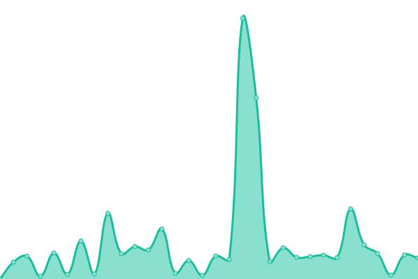
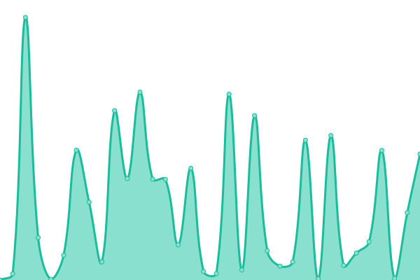

# [📈 Live Status](https://status.n1l.dev): <!--live status--> **🟩 All systems operational**

This repository contains the open-source uptime monitor and status page for [n1lsqn](https://status.n1l.dev), powered by [Upptime](https://github.com/upptime/upptime).

With [Upptime](https://upptime.js.org), you can get your own unlimited and free uptime monitor and status page, powered entirely by a GitHub repository. We use [Issues](https://github.com/n1lsqn/status/issues) as incident reports, [Actions](https://github.com/n1lsqn/status/actions) as uptime monitors, and [Pages](https://status.n1l.dev) for the status page.

<!--start: status pages-->
<!-- This summary is generated by Upptime (https://github.com/upptime/upptime) -->
<!-- Do not edit this manually, your changes will be overwritten -->
<!-- prettier-ignore -->
| URL | Status | History | Response Time | Uptime |
| --- | ------ | ------- | ------------- | ------ |
|  [papi.n1l.dev](https://papi.n1l.dev) | 🟩 Up | [papi-n1l-dev.yml](https://github.com/n1lsqn/status/commits/HEAD/history/papi-n1l-dev.yml) | 

 712ms
     
 | 

<a href="https://status.n1l.dev/history/papi-n1l-dev">100.00%</a>
    

|  [m.n1l.dev](https://m.n1l.dev) | 🟩 Up | [m-n1l-dev.yml](https://github.com/n1lsqn/status/commits/HEAD/history/m-n1l-dev.yml) | 

 500ms
     
 | 

<a href="https://status.n1l.dev/history/m-n1l-dev">99.83%</a>
    

|  [dw.n1l.dev](https://dw.n1l.dev) | 🟩 Up | [dw-n1l-dev.yml](https://github.com/n1lsqn/status/commits/HEAD/history/dw-n1l-dev.yml) | 

 525ms
     
 | 

<a href="https://status.n1l.dev/history/dw-n1l-dev">100.00%</a>
    

|  [rasp.n1l.dev](https://rasp.n1l.dev) | 🟩 Up | [rasp-n1l-dev.yml](https://github.com/n1lsqn/status/commits/HEAD/history/rasp-n1l-dev.yml) | 

 5164ms
     
 | 

<a href="https://status.n1l.dev/history/rasp-n1l-dev">98.17%</a>
    

|  [mogeko.monster](https://mogeko.monster) | 🟩 Up | [mogeko-monster.yml](https://github.com/n1lsqn/status/commits/HEAD/history/mogeko-monster.yml) | 

 837ms
     
 | 

<a href="https://status.n1l.dev/history/mogeko-monster">100.00%</a>
    

|  [ObjectStorage](https://s3-console.n1l.dev/) | 🟩 Up | [object-storage.yml](https://github.com/n1lsqn/status/commits/HEAD/history/object-storage.yml) | 

 516ms
     
 | 

<a href="https://status.n1l.dev/history/object-storage">100.00%</a>
    

|  [Upptime](https://status.n1l.dev) | 🟩 Up | [upptime.yml](https://github.com/n1lsqn/status/commits/HEAD/history/upptime.yml) | 

 137ms
     
 | 

<a href="https://status.n1l.dev/history/upptime">100.00%</a>
    

|  [peertube](https://peertube.n1l.dev) | 🟩 Up | [peertube.yml](https://github.com/n1lsqn/status/commits/HEAD/history/peertube.yml) | 

 505ms
     
 | 

<a href="https://status.n1l.dev/history/peertube">99.37%</a>
    

<!--end: status pages-->

[**Visit our status website →**](https://status.n1l.dev)

## 📄 License

- Powered by: [Upptime](https://github.com/upptime/upptime)
- Code: [MIT](./LICENSE) © [n1lsqn](https://status.n1l.dev)
- Data in the `./history` directory: [Open Database License](https://opendatacommons.org/licenses/odbl/1-0/)
